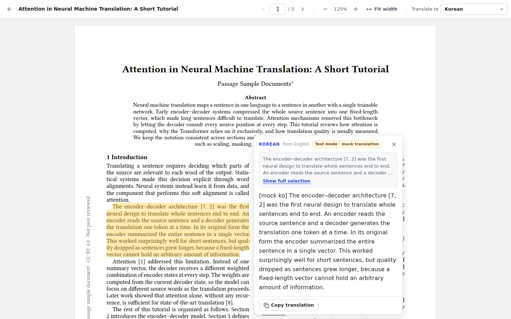
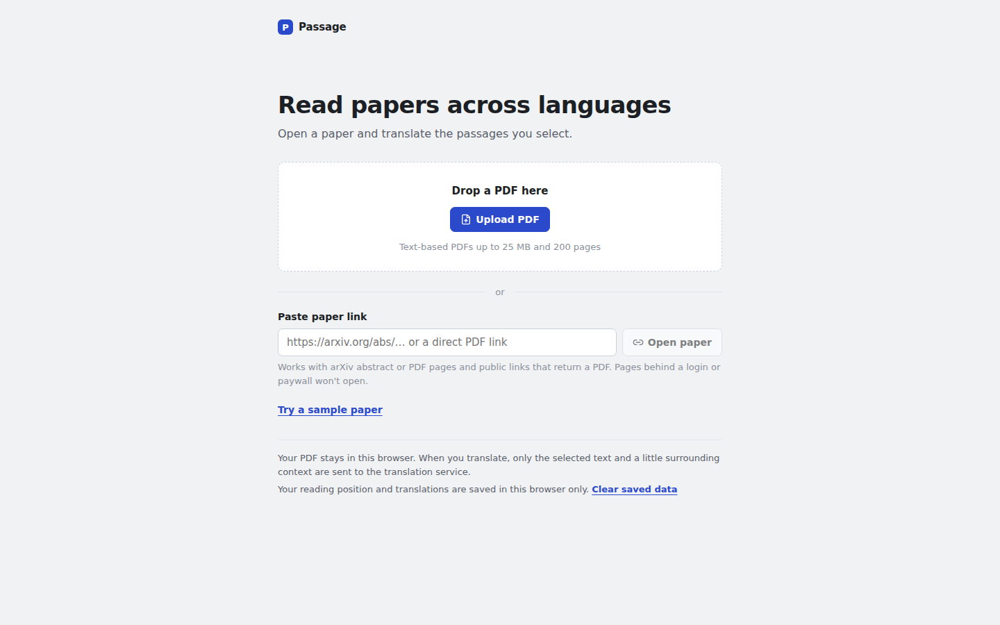
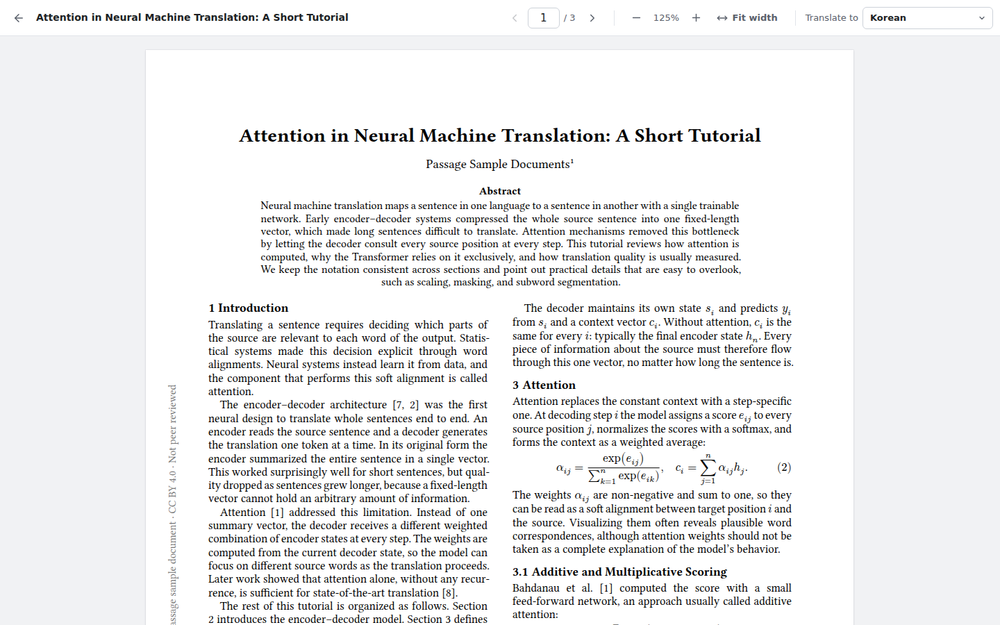
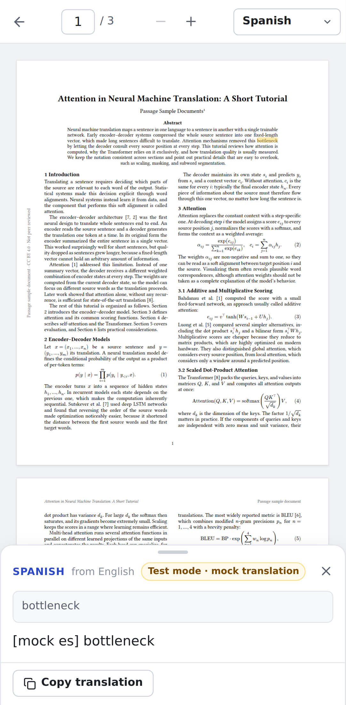

# Passage

Read research papers across languages. Open a PDF (upload or link), select a word, sentence, or paragraph, and read its translation right next to the passage without losing your place.



*The screenshots come from the automated test setup: the card shows a clearly labelled mock translation (“Test mode · mock translation”). With an API key configured, the same card shows the real translation.*

| Import | Reader | Phone |
| --- | --- | --- |
|  |  |  |

---

## Quick start

You need **Node.js 22.12 or newer** ([download](https://nodejs.org)).

```bash
npm install
cp .env.example .env        # then open .env and paste your key after ANTHROPIC_API_KEY=
npm run dev
```

Open **http://localhost:5173**. The app works without a key, but translation shows “Translation is unavailable…” until `ANTHROPIC_API_KEY` is set and the server restarted.

Get a key at [console.anthropic.com](https://console.anthropic.com) → API Keys. The key stays on the server; it is never sent to the browser.

## Settings (`.env`)

| Variable | Default | What it does |
| --- | --- | --- |
| `ANTHROPIC_API_KEY` | — | **Required for translation** with Claude. |
| `PASSAGE_TRANSLATION_MODEL` | `claude-opus-5` | Model id. Any Claude model works, e.g. `claude-sonnet-5` or `claude-haiku-4-5` (cheaper, faster). |
| `PASSAGE_TRANSLATION_EFFORT` | `low` | `low`, `medium`, `high`, `xhigh`, `max`, or `none`. Use `none` for models that don't accept it (Haiku 4.5). |
| `PASSAGE_REFUSAL_FALLBACK` | `true` | If the model declines a passage, Anthropic retries it on a recommended fallback model within the same request. |
| `PASSAGE_TRANSLATION_PROVIDER` | `anthropic` | `anthropic`, or `ollama` for a local model (see below). `mock` is for automated tests only. |
| `OLLAMA_BASE_URL` | `http://127.0.0.1:11434` | Local model server address (local mode). |
| `PASSAGE_OLLAMA_NUM_CTX` | `12288` | Local model's text window in tokens. Big enough for the longest selection; lower it on low-memory machines. |
| `PORT` / `HOST` | `8787` / `127.0.0.1` | Where the server listens. Use `HOST=0.0.0.0` in containers. |
| `PASSAGE_TRUST_PROXY` | `false` | Set `true` behind a reverse proxy so rate limits see the real client address. |
| `PASSAGE_MAX_FILE_MB` | `25` | Largest PDF for upload and link import. |
| `PASSAGE_MAX_PAGES` | `200` | Largest page count. |
| `PASSAGE_MAX_SELECTION_CHARS` | `6000` | Longest selection per translation. |
| `PASSAGE_TRANSLATE_RATE_PER_MIN` | `30` | Translations per minute per client. |
| `PASSAGE_TRANSLATE_CONCURRENCY` | `4` | Simultaneous translation requests to the provider (extra requests wait briefly, then get “busy”). |
| `PASSAGE_TRANSLATE_TIMEOUT_MS` | `90000` | Time limit for one translation. |
| `PASSAGE_IMPORT_RATE_PER_MIN` / `PASSAGE_IMPORT_TIMEOUT_MS` | `10` / `25000` | Link-import throttling and time limit. |

The limits the server enforces are reported to the browser, so the interface always shows the real values.

**Cost (estimate):** with the default model, one paragraph costs roughly 1–3 US cents (about 1,000 input tokens of instructions, selection, and context, plus the translation). Words and sentences cost less. Switching the model to `claude-sonnet-5` or `claude-haiku-4-5` lowers this.

## Local model instead of Claude (optional)

Translation can run entirely on your computer through [Ollama](https://ollama.com). Nothing leaves the machine and there is no per-use cost.

1. Install Ollama and pull a model once (5–10 GB): `ollama pull qwen3:8b`
2. In `.env`: `PASSAGE_TRANSLATION_PROVIDER=ollama` and `PASSAGE_TRANSLATION_MODEL=qwen3:8b`
3. Restart `npm run dev`. The import screen then says translation runs on this computer.

Honest trade-off: laptop-sized models translate scientific text noticeably less faithfully than Claude. They're more likely to drop a negation or flatten hedged wording ("may suggest" becoming "shows"), especially into Korean or Japanese, and they're slower on older machines. Any model you have pulled in Ollama works. Passage asks it to skip its "thinking" step for speed.

## What you can open

- **PDF upload**: file picker or drag and drop. The file's bytes are checked (a real PDF header), not just the `.pdf` name.
- **Links**: public URLs that return PDF bytes (with or without `.pdf` in the address), and arXiv pages: abstract, PDF, or HTML links, versioned or not (`https://arxiv.org/abs/2301.00001v2`, `arxiv.org/pdf/…`, even `arXiv:2301.00001`). arXiv links are turned into the paper's PDF.
- **Sample paper**: “Try a sample paper” opens a short two-column paper written for Passage (CC BY 4.0).

Links that lead to a web page, a login, or a paywall show: *“This link doesn't lead to an accessible PDF. Upload the file or paste a direct PDF link.”* The link stays in the box so you can fix it. DOIs and publisher landing pages generally don't work; download the PDF and upload it instead.

Clear messages cover files that aren't PDFs, damaged files, password-protected files, files over the size or page limit, unreachable or blocked links, and too many requests. Scanned PDFs open for reading, with a note that translation needs selectable text (no OCR in this version).

## Reading and translating

1. Select text on the page: drag across it, or double-click a word.
2. Click **Translate** next to the selection, or press **T**.
3. The first time, pick the language in the card. It's remembered, and you can change it any time with **Translate to** in the toolbar.

The passage gets a soft highlight, and the card opens next to it with the original excerpt, the translation, and **Copy translation**. **Esc** or **×** closes it without moving the page. Selecting the same passage again shows the saved translation instantly. Changing the language re-translates the open passage.

- Target languages: English, Korean, Japanese, Simplified Chinese, Spanish, French, German.
- If the passage already seems to be in the target language, Passage says so and offers other languages (or “Translate anyway”) without spending a request.
- Selections longer than 6,000 characters, or spanning two pages, get a short instruction instead of being cut off silently.
- On phones the card becomes a bottom sheet.

### What is sent where

- Your PDF stays in your browser. Uploaded files are never sent to the server. For link imports, the Passage server downloads the PDF, passes it to your browser, and does not store it.
- When you translate, the server sends the provider only the selected text, up to about 1,200 characters before and 600 after it, the paper's title, and the nearest section heading. Never the whole PDF.
- Server logs record sizes, timings, and outcomes only, never document text, translations, or keys.

## What's saved in your browser

Passage remembers, in this browser only (IndexedDB):

- the current paper (one PDF file at a time; opening another replaces it),
- your reading position and zoom for recent papers,
- completed translations (reused when you select the same passage again),
- your “Translate to” choice.

A refresh reopens the paper where you left off. **Clear saved data** on the start screen removes all of it. Nothing is synced across devices or browsers. If the browser blocks storage (some private modes) or runs out of space, you can keep reading, and Passage tells you the paper won't be restored after a refresh.

## Known limits

- Text selection needs a real text layer: scanned pages can be read but not translated (no OCR).
- One page at a time: selections that cross a page boundary are refused with an explanation.
- Unusual PDFs (broken font maps) can yield garbled characters; Passage warns when it notices, and refuses clearly unreadable selections.
- Column and paragraph detection is tuned for typical one- and two-column papers. Unusual layouts (three columns, heavy math, side notes) may join or split paragraphs imperfectly. The card always shows the exact text that was translated.
- Link import cannot follow logins, paywalls, publisher pages, or DOI redirects to non-PDF pages.
- Rate limits and saved state are per server process (no shared database).

## Running in production

```bash
npm run build     # type-checks, builds the browser app and the server
npm start         # serves app + API on PORT (default 8787)
```

`npm start` serves the built app from `dist/client` with a strict content security policy. Put it behind HTTPS in real deployments (browser features such as the clipboard work best on HTTPS). Set `HOST=0.0.0.0` inside containers and `PASSAGE_TRUST_PROXY=true` behind a proxy.

## Tests and verification

```bash
npm run typecheck   # TypeScript, client and server
npm test            # unit tests (Vitest)
npm run test:e2e    # builds, then runs browser tests (Playwright, Chromium)
```

Browser tests start the built server with the **mock translation provider**. Its output reads `[mock ko] …` and the card is labelled “Test mode · mock translation”, so the tests check the app's behavior, not translation quality. The mock is off unless `PASSAGE_TRANSLATION_PROVIDER=mock` is set.

What the automated tests cover:

- **Selection text** (on layout data from real PDFs): words, sentences, paragraphs, headings, two-column continuation, running heads and page numbers left out, stray text from the other column left out, hyphenation, ligatures, reference lists, German, Korean, Japanese.
- **Positions**: highlight alignment through zoom, resize, and scroll; card placement.
- **Translation flow**: request IDs, stale answers never replacing newer ones, duplicate clicks, cache reuse and language changes, errors and retry, missing credentials.
- **Link import safety**: private, loopback, link-local, and metadata addresses; redirects re-checked; DNS rebinding; size and time limits; non-PDF responses.
- **Server**: validation, rate limits, streaming format, and the Claude and Ollama adapters against stand-in servers that speak their protocols.

To regenerate the fixture PDFs: `pip install typst pymupdf && npm run fixtures`. To refresh screenshots: `PASSAGE_SCREENSHOTS=1 npx playwright test e2e/screenshots.spec.ts e2e/mobile.spec.ts`.

## How it's built

- **Vite + React + TypeScript** for the browser app. **Hono** (a small web server) for the two server endpoints. Chosen for a small, fast, standard setup with one language across client and server.
- **pdf.js** (Mozilla) renders pages to a canvas and lays its selectable text layer on top. Passage uses its own page layout so only pages near the viewport are rendered; far pages release their memory. It uses pdf.js's compatibility build so older Chrome and Safari versions work too.
- **Selection → text**: the browser selection is mapped back to pdf.js text items and characters. Passage then rebuilds the passage from the text's geometry: it joins wrapped lines, keeps real paragraph breaks, repairs line-break hyphens only when clearly safe, and drops page furniture and other-column leakage. Every character keeps a pointer back to its source, and the highlight is drawn from exactly the text that was kept.
- **Anchors**: document fingerprint (SHA-256), page, text offsets and item references, a short prefix and suffix, and highlight rectangles relative to the page, so highlights stay aligned at any zoom.
- **Translation**: `POST /api/translate` streams the answer back line by line (partial text shows as it arrives; only complete answers are saved). Every request carries an ID; outdated requests are cancelled, and late answers are ignored.
- **Link import**: `POST /api/import` fetches server-side with DNS answers validated and pinned per connection, redirects re-checked, and size and time limits. No cookies or credentials are forwarded.

The product name lives in `shared/brand.ts`; change it there.

## Credits and licenses

- pdf.js © Mozilla (Apache-2.0). Text-layer CSS and the selection helper are adapted from it, with notices in those files.
- The sample papers in `fixtures/` and `public/samples/` were written for Passage and are released under CC BY 4.0 (see `fixtures/README.md`).
